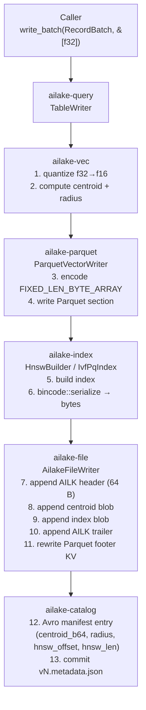

# DATA_FLOW.md — End-to-End Data Flows

## Write path



```
Caller
  │
  │  write_batch(record_batch: RecordBatch, embeddings: &[f32])
  ▼
ailake-query / TableWriter
  │
  ▼
ailake-file / AilakeFileWriter
  │
  ├─► ailake-vec
  │     │  1. quantize f32 → f16  (VectorPrecision::F16)
  │     │  2. compute centroid (mean) and radius (max distance to centroid)
  │     └─► returns: (centroid: Vec<f32>, radius: f32, quantized: Vec<u8>)
  │
  ├─► ailake-parquet / ParquetVectorWriter
  │     │  3. encode RecordBatch with embedding column as
  │     │     FIXED_LEN_BYTE_ARRAY(dim * 2), F16 bytes
  │     │     field metadata: {"ailake.dim": "1536", "ailake.metric": "cosine",
  │     │                       "ailake.precision": "f16"}
  │     │  4. write Parquet to part-NNNNN.parquet (Parquet section only)
  │     │  5. record offset where Parquet ended (just after final PAR1)
  │     └─► returns: parquet_end_offset
  │
  ├─► ailake-index / HnswBuilder
  │     │  6. build HNSW: insert each (RowId(N), vector_f32) pair
  │     │     (vectors expanded F16 → F32 for the HNSW builder)
  │     │  7. serialize HNSW via bincode
  │     └─► returns: hnsw_bytes: Vec<u8>
  │
  └─► ailake-file (back in AilakeFileWriter)
        │  8. append AI-Lake header (64 bytes) at parquet_end_offset
        │  9. append centroid section: centroid bytes + radius
        │ 10. append HNSW graph section: hnsw_bytes
        │ 11. append AI-Lake trailer (24 bytes) at end of file
        │ 12. rewrite Parquet footer with updated key_value_metadata:
        │       ailake.hnsw_offset = parquet_end_offset
        │       ailake.hnsw_len = (file_size - parquet_end_offset)
        │     (this is a footer rewrite, not a file rewrite)
        └─► returns: AilakeFileMeta { path, record_count, centroid, radius,
                                       hnsw_offset, hnsw_len }

Back in TableWriter:
  │
  └─► ailake-catalog / SnapshotManager.commit()
        │ 13. create new Iceberg DataFile entry with custom_properties:
        │       ailake.centroid = base64(centroid)
        │       ailake.radius = "0.342"
        │       ailake.hnsw_offset = ...
        │       ailake.hnsw_len = ...
        │ 14. append DataFile to snap-NNN.avro
        │ 15. atomically update metadata/v{N+1}.metadata.json
        └─► returns: SnapshotId

Invariant after commit:
  row N in part-NNNNN.parquet
    == HNSW node with key RowId(N) in the AI-Lake footer of the same file
```

**Atomicity**: steps 13–15 are a single logical transaction managed by Iceberg. If the process dies before step 15, the `.parquet` file exists but is not referenced by the manifest — it's an orphan, cleaned by a future vacuum. The Iceberg snapshot commit (step 15) is the only commit point.

**Important**: step 12 (Parquet footer rewrite) is necessary because the Parquet footer offsets must be written before we know the HNSW size. Sequence:
- Write Parquet with placeholder footer metadata
- Append AI-Lake extension
- Seek back, rewrite Parquet footer with correct `ailake.hnsw_offset/len`
- The rewrite is bounded — only the last few KB of the file change

### FTS write path (opt-in via `fts_columns`)

When `TableWriter` is constructed with `fts_columns = ["chunk_text", ...]`, `AilakeFileWriter` additionally:

```
After HNSW/IVF-PQ section is written:
  │
  ├─► ailake-fts / FtsIndexBuilder
  │     │  for each row in RecordBatch:
  │     │    add_doc(row_id, [(col, text), ...]) for each fts_column
  │     └─► finish() → zstd-compressed Tantivy index bytes
  │
  └─► AilakeFileWriter
        │  append AILK_FTS section header (magic "AFTS", version, len)
        │  append compressed Tantivy index bytes
        │  rewrite Parquet footer KV:
        │    ailake.fts_offset = <byte offset of AILK_FTS section>
        │    ailake.fts_len    = <length of AILK_FTS section>
        └─► FLAG_HAS_FTS set in AilakeHeader.flags
```

Storage: ~3-4 MB per file for 50k documents with `WithFreqs` (no stored fields, no positions).

---

## Deferred write path (HNSW and IVF-PQ)

`write_batch_deferred` (HNSW) and `write_batch_ivf_pq_deferred` (IVF-PQ) decouple Parquet write latency from index build time.

```
Caller
  │
  │  write_batch_deferred(batch, embeddings)
  ▼
TableWriter (fast path — Parquet only)
  │
  ├─► AilakeFileWriter::write_parquet_only()
  │     → Parquet bytes, no AILK section
  │
  ├─► store.put(file_path, parquet_bytes)
  │     → S3 PUT, returns in ~4s for 200k vec/s
  │
  ├─► catalog entry: IndexStatus::Indexing
  │
  └─► tokio::spawn (background task)
        │
        ├─► [IVF-PQ only] OnceCell::get_or_try_init
        │     → first task trains codebook (k-means)
        │     → subsequent tasks await and reuse shared codebook
        │
        ├─► build HNSW or IvfPqIndex::build_with_codebook
        │
        ├─► AilakeFileWriter::write (rewrite file with AILK section)
        │
        ├─► store.put (overwrite Parquet-only file with full AILK file)
        │
        └─► CAS retry loop:
              load current snapshot → mark file Ready → commit Replace snapshot
              verify Ready survived (sibling tasks may race) → retry if not
```

**Throughput**: write returns after the Parquet PUT — ~200k vec/s for both engines. Index builds in background without blocking ingestion.

**`IndexStatus` lifecycle**: `Indexing` (set at commit time) → `Ready` (set by background task after AILK section is written and catalog updated) or `Failed` (set by `patch_index_failed()` if the build errors). The `SearchSession` serves both `Indexing` and `Failed` shards via **flat scan** (exact O(N) brute-force) rather than HNSW/IVF-PQ — no data loss or query downtime. `Failed` files include an `index_error` reason string in `key_metadata` and are rebuilt automatically at the next compaction run. `Replace` commits overwrite the manifest list with the new complete state to avoid duplicate entries.

---

## Read path — vector search

```mermaid
flowchart TD
    C["Caller\nsearch(table_uri, &[f32], top_k)"]
    CAT["ailake-catalog\n1. read metadata.json → snapshot\n2. read snap-NNN.avro → DataFileEntry list\n3. decode centroid_b64, radius per file"]
    PRUNE["ailake-query / VectorPruner\n4. dist(query, centroid) - radius > threshold?\n   YES → skip file (zero S3 I/O)"]
    FILTER["ailake-parquet / ParquetVectorReader\n5a. column_filter set? → matching_row_ids()\n   (row-group skip + column projection;\n    empty match → skip file entirely)"]
    STORE["ailake-store\n5b. primary column, no filter/rerank/hybrid/\n   score_fn/eq-delete, IndexStatus::Ready,\n   non-foreign → range-GET (footer→header→blob)\n   else → GET full file"]
    MMAP["ailake-index / MmapLoader or index_loader\n5c. mmap or in-memory bincode::deserialize\n    HnswIndex or IvfPqIndex\n    (dispatched by AnyIndex from flags field)"]
    SEARCH["ailake-index\n5d. index.search(query, candidate_k)\n   rows outside 5a's match set discarded"]
    MERGE["merge all per-file results\nglobal top-k sort"]
    FETCH["ailake-parquet / ParquetVectorReader\n6. read specific rows for winners"]
    OUT["RecordBatch\n(all columns + _distance: f32)"]

    C --> CAT --> PRUNE
    PRUNE -->|surviving files, via try_join_all| FILTER --> STORE --> MMAP --> SEARCH --> MERGE
    MERGE --> FETCH --> OUT
```



```
Caller
  │
  │  search(table_uri, query: &[f32], top_k: usize, filter: Option<&str>)
  ▼
ailake-query / VectorScanner
  │
  ├─► ailake-catalog / SnapshotManager
  │     │  1. read metadata.json → find current snapshot
  │     │  2. read snap-NNN.avro → load all DataFile entries
  │     │  3. for each entry, decode custom_properties:
  │     │       centroid = base64_decode(ailake.centroid) → [f32; dim]
  │     │       radius = parse_f32(ailake.radius)
  │     │       hnsw_offset, hnsw_len
  │     └─► returns: Vec<FileCandidate>
  │
  ├─► ailake-query / VectorPruner
  │     │  4. for each candidate:
  │     │       dist = cosine_distance(query, candidate.centroid)
  │     │       if dist - candidate.radius > search_threshold → PRUNE
  │     └─► returns: Vec<FileCandidate>  (only survivors)
  │
  ├─► [for each surviving candidate — search_one_file() dispatched via
  │    futures::future::try_join_all: cooperative concurrency on the current
  │    task, overlapping I/O latencies; not tokio::spawn, not a thread pool]
  │   │
  │   ├─► ailake-core / SearchConfig::column_filter (if set)
  │   │     │  5a. ParquetVectorReader::matching_row_ids() — row-group skip
  │   │     │      via Parquet min/max stats + column-projected decode of
  │   │     │      just the filtered column (no HNSW, no vector decode yet)
  │   │     │  empty match set → skip this file entirely (zero further I/O)
  │   │     └─► returns: HashSet<RowId> (file-relative positions)
  │   │
  │   ├─► ailake-store / Store
  │   │     │  5b. if query only needs the primary column's index (no
  │   │     │      column_filter/rerank_factor/score_fn/hybrid/equality-
  │   │     │      delete, IndexStatus::Ready, non-foreign):
  │   │     │        index_loader::load_primary_index — range-GET only
  │   │     │        (speculative tail window → footer_offset → AILK header
  │   │     │        → HNSW/IVF-PQ blob, reusing bytes already fetched)
  │   │     │      else: GET the whole file (store.get)
  │   │     └─► returns: file bytes (partial or whole)
  │   │
  │   ├─► ailake-index / MmapLoader or bincode::deserialize
  │   │     │  6a. parse AI-Lake header flags:
  │   │     │       flags & 0x0001 → IvfPqSerializer::from_bytes
  │   │     │       default         → HNSW deserialize (mmap when loaded via
  │   │     │                          a temp file, in-memory for range-GET
  │   │     │                          bytes already resident from 5b)
  │   │     └─► returns: AnyIndex (Hnsw | IvfPq)
  │   │
  │   └─► AnyIndex::search(query, top_k, ef)
  │         │  HNSW:   greedy graph traversal, candidate heap
  │         │  IVF-PQ: coarse quantize, nprobe cells, ADC distance
  │         │  rows outside 5a's match set (when column_filter is set) and
  │         │  rows in the deletion-vector/equality-delete set are discarded
  │         └─► returns: Vec<(RowId, f32)>
  │
  ├─► merge results across all surviving files (folded after every
  │   search_one_file() future resolves), global top-k sort
  │
  ├─► ailake-store / Store
  │     │  7. for each winning RowId, identify which Parquet file owns it
  │     │     (each RowId is scoped to its file)
  │     └─► returns: Vec<(file_path, RowId, distance)>
  │
  ├─► ailake-parquet / ParquetVectorReader
  │     │  8. for each (file_path, RowId): read the specific row containing
  │     │     that RowId (predicate pushdown already happened in step 5a,
  │     │     not here — this step just fetches the winning rows' full data)
  │     └─► returns: RecordBatch with full row data
  │
  └─► return RecordBatch (columns: all table columns + _distance: f32)
```

**Performance note**: step 4 (centroid pruning) is the critical path for petabyte scale. The centroid array for 10,000 files × 1536 dims × 4 bytes = ~60 MB, fits comfortably in memory. Zero file I/O for pruned files.

**Network cost analysis** (per file):
- Pruned file: 0 bytes from S3 (centroid read from Avro manifest, no Parquet/footer access)
- Surviving file, primary-column fast path eligible (no `column_filter`/rerank/hybrid/`score_fn`/equality-delete, index `Ready`, non-foreign): range-GET only — tail window + AILK header + HNSW/IVF-PQ blob, typically ~1-15 MB depending on index size, not the whole file
- Surviving file, fast path *not* eligible (secondary/multimodal column, `column_filter` set, rerank, hybrid, `score_fn`, equality-delete present, or index not yet `Ready`): full-file GET (`store.get`) — can be the entire Parquet + AILK footer, not just the index
- Winning row fetch (step 8): ~1 MB row read per winner, on top of whichever GET pattern applied above

---

## Read path — full-text search (`search_text`)

`search_text(table, query_text, top_k, text_columns)` has two paths depending on whether the file has a Tantivy FTS index:

```
ailake-query / search_text
  │
  ├─► ailake-catalog: list_files → Vec<DataFileEntry>
  │     (centroid pruning NOT applied — FTS search spans all files)
  │
  └─► [for each file, sequentially — search_text() does not use the
       try_join_all concurrency search()/search_multimodal() use]
        │
        ├─► CHECK: DataFileEntry.fts_offset.is_some()?
        │
        ├─► YES (file has AILK_FTS section) — Tantivy O(log N) fast path
        │     ├─► ailake-store: GET range [fts_offset, fts_offset + fts_len)
        │     ├─► ailake-fts: FtsReader::from_bytes(compressed_bytes)
        │     └─► FtsReader::search_multi_column(query, text_columns, top_k)
        │           → Vec<(row_id, bm25_score)>
        │
        └─► NO (legacy file, no FTS section) — BM25 brute-force O(N) fallback
              ├─► ailake-store: GET full Parquet file (or column projection)
              └─► BM25Scorer::score_all(query, column_values)
                    → Vec<(row_id, bm25_score)>  (IdfStats from metadata)

Merge top-k results across all files by descending bm25_score.
Return: Vec<SearchResult { row_id, distance: -score, file_path }>
  (distance = negated BM25 score, consistent with vector search convention)
```

**Hybrid search** (`SearchConfig::hybrid = Some(HybridConfig { text, bm25_weight })`) combines the vector HNSW pipeline with BM25 scoring via Reciprocal Rank Fusion:
1. HNSW pipeline retrieves `10 × top_k` vector candidates.
2. BM25 pipeline scores each candidate against `hybrid_text`.
3. RRF: `final_score = Σ weight_i / (60 + rank_i)` — merged and re-sorted.

---

## Read path — standard Iceberg (no AI-Lake plugin)

```
Spark / Trino / DuckDB / PyIceberg
  │
  │  1. read metadata/v{N}.metadata.json
  │     → sees ailake.* properties, does not understand them, ignores
  │
  │  2. read snap-NNN.avro  (standard Iceberg manifest)
  │     → lists DataFile entries: data/part-NNNNN.parquet
  │     → custom_properties contains ailake.* keys
  │     → framework exposes them as opaque string map or ignores
  │
  │  3. read data/part-NNNNN.parquet
  │     → Parquet reader sees the final PAR1 magic and stops
  │     → never touches the AI-Lake footer (after the final PAR1)
  │     → schema has column "embedding" as FIXED_LEN_BYTE_ARRAY
  │     → framework reads it as raw bytes or skips if not projected
  │
  └─► returns all non-vector columns normally; "embedding" column = bytes
```

No errors. No surprises. The AI-Lake footer is invisible — Parquet specification mandates that readers stop at the final `PAR1` marker.

---

## Compaction flow

Triggered when the snapshot accumulates many small files (default threshold: 16 files smaller than 64 MB).

```
Compactor (background Tokio task)
  │
  │  1. identify small files to compact (read DataFile sizes from manifest)
  │
  ├─► ailake-file / AilakeFileReader
  │     │  2. for each input file: read full Parquet content + read full HNSW
  │     └─► returns: Vec<RecordBatch> + Vec<HnswIndex>
  │
  ├─► ailake-file / AilakeFileWriter
  │     │  3. concatenate RecordBatches
  │     │  4. recompute centroid + radius for the merged batch
  │     │  5. rebuild HNSW from scratch with all vectors
  │     │       (HNSW merge is non-trivial; we rebuild for simplicity in Phase 2.
  │     │        Phase 4 may implement true incremental HNSW merge.)
  │     │  6. write new unified file part-MERGED-NNN.parquet
  │     └─► returns: AilakeFileMeta
  │
  └─► ailake-catalog
        │  7. create new Iceberg snapshot:
        │       - REPLACE the N input files with the 1 output file
        │  8. old files become unreferenced — vacuum will remove them after retention period
        └─► returns: SnapshotId

Concurrent reads during compaction:
  - Readers use the snapshot at the time of their query start (Iceberg snapshot isolation)
  - New merged file is not visible until the catalog commit
  - Old files remain readable until vacuum (typically 7 days retention)
```

**Why rebuild HNSW instead of merging?** `ailake-index`'s custom HNSW implementation does not provide a primitive for merging two indexes that preserves graph quality. Rebuilding from scratch is O(N log N) but only runs at compaction time (not on the hot write path). The merge produces a single high-quality HNSW with better search recall than the union of two smaller indexes.

---

## Centroid computation (on write)

Called in step 1 of the write path. Must be fast — runs synchronously before writing.

```rust
// ailake-vec/src/distance.rs
pub fn compute_centroid_and_radius(
    vectors: &[Vec<f32>],
    metric: VectorMetric,
) -> (Vec<f32>, f32) {
    let dim = vectors[0].len();

    // mean of all vectors
    let mut centroid = vec![0.0_f32; dim];
    for v in vectors {
        for (i, &x) in v.iter().enumerate() {
            centroid[i] += x;
        }
    }
    let n = vectors.len() as f32;
    for x in &mut centroid {
        *x /= n;
    }

    // normalize for cosine metric
    if matches!(metric, VectorMetric::Cosine) {
        let norm: f32 = centroid.iter().map(|x| x * x).sum::<f32>().sqrt();
        if norm > 0.0 {
            for x in &mut centroid {
                *x /= norm;
            }
        }
    }

    // radius = max distance from any vector to centroid
    let radius = vectors
        .iter()
        .map(|v| metric.distance(v, &centroid))
        .fold(0.0_f32, f32::max);

    (centroid, radius)
}
```

The centroid is base64-encoded into the Avro manifest. For dim=1536, this is ~8 KB per file entry — acceptable for tens of thousands of files.

---

## Context assembly flow (RAG use case)

```
Caller
  │
  │  assembler.assemble_chunks(chunks: Vec<Chunk>) -> AssembledContext
  ▼
ailake-query / ContextAssembler
  │
  │  1. deduplication
  │       sort by distance (ascending — most relevant first)
  │       for each pair (a, b): if cosine_distance(a.embedding, b.embedding) < dedup_threshold
  │         keep the chunk that appeared first (already sorted by relevance)
  │
  │  2. group by document_id, sort each group by chunk_index ascending
  │       cap each group at max_chunks_per_document (default: 10)
  │
  │  3. token budget (char budget = max_tokens × 4)
  │       greedily include chunks until char_budget would be exceeded
  │
  │  4. render XML
  │
  │       <context>
  │         <document id="{doc_id}" title="{title}" source="{uri}">
  │           <chunk index="{n}" section="{section}">
  │             <text>{chunk_text}</text>
  │           </chunk>
  │           ...
  │         </document>
  │         ...
  │       </context>
  │
  └─► return AssembledContext { text: String, token_estimate: usize, chunk_count: usize }
```

---

## JVM plugin flow — Rust core ↔ Trino / Spark via JNA

The JVM plugins (Trino `VectorScanConnector`, Spark `VectorScanStrategy`) are
thin adapters. No search logic lives in JVM code — everything runs inside the
Rust `libailake_jni.so` cdylib loaded via JNA at startup.

```mermaid
sequenceDiagram
    participant E as Query Engine<br/>(Trino / Spark)
    participant P as JVM Plugin<br/>(AilakeNative.search)
    participant L as libailake_jni.so<br/>(Rust #[no_mangle] C-ABI)
    participant Q as ailake-query<br/>(search + pruning)
    participant S as Object Store<br/>(S3 / GCS / local)

    E->>P: execute() / VectorScanExec.doExecute()
    P->>P: serialize query vector to JSON request
    P->>L: ailake_search_json(const char* request_json)
    note over P,L: JNA: Java String → C *char<br/>pointer ownership: Rust allocates
    L->>Q: do_search(warehouse, table, query_vec, top_k)
    Q->>S: GET metadata/vN.metadata.json
    Q->>S: GET metadata/snap-N-1.avro (manifest list)
    Q->>S: GET metadata/{snap_id}-m0.avro (manifest)
    note over Q: decode DataFileEntry centroid/radius<br/>geometric pruning — zero I/O for pruned files
    loop surviving files, via try_join_all (cooperative concurrency, not a thread pool)
        Q->>S: range-GET index only (primary column, fast path eligible) or GET whole file
        Q->>Q: bincode::deserialize → index<br/>index.search(query, top_k)
    end
    Q-->>L: Vec&lt;SearchResult&gt; { row_id, distance, file_path }
    L-->>P: JSON {"ok":true,"results":[{"row_id":N,"distance":F,"file_path":"..."}]}
    P->>L: ailake_free_string(ptr)
    note over P,L: Rust frees the CString allocation
    P-->>E: Iterator&lt;Row&gt; / RDD[InternalRow]
```

**C-ABI contract** (`ailake-jni/src/lib.rs`):

```c
// All strings: UTF-8, null-terminated, little-endian platform.
// Caller MUST call ailake_free_string() on every non-null return value.

char* ailake_search_json(const char* request_json);
// request:  {"warehouse":"...","namespace":"...","table":"...",
//            "vec_col":"embedding","dim":1536,"query":[...],"top_k":10}
// response: {"ok":true,"results":[{"row_id":N,"distance":F,"file_path":"..."}]}
//        or {"ok":false,"error":"..."}

char* ailake_write_batch_json(const char* request_json);
// request:  {"warehouse":"...","namespace":"...","table":"...",
//            "dim":1536,"ids":[...],"embeddings":[[...],...]}
// response: {"ok":true,"snapshot_id":N}

void  ailake_free_string(char* ptr);

const char* ailake_version();   // static string — do NOT free
```

Library path configuration:
- **Trino**: add `-Djava.library.path=/opt/ailake/lib` to `etc/jvm.config`
- **Spark**: `--conf "spark.driver.extraJavaOptions=-Djava.library.path=..."`
- **Kubernetes**: bake `libailake_jni.so` into the executor Docker image
