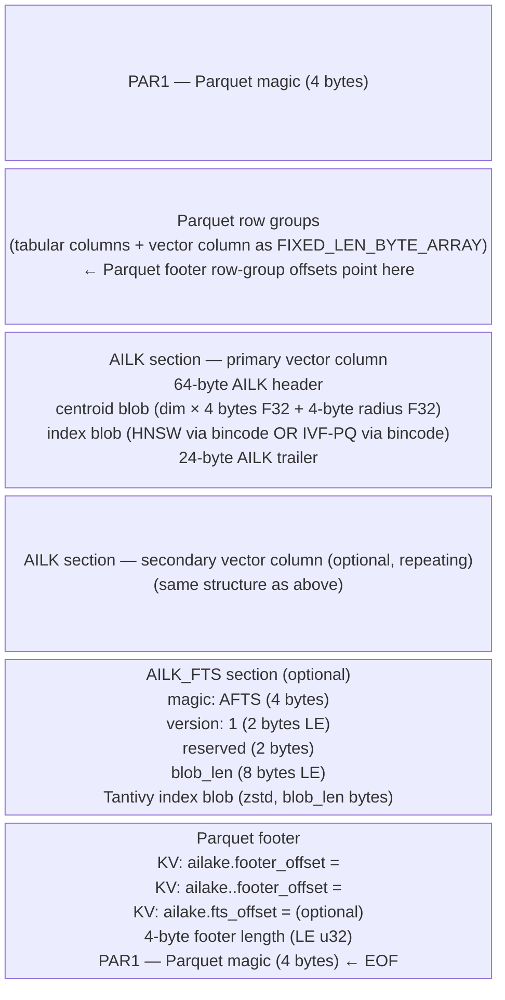

# AI-Lake File Format Specification — v1

**Status**: Stable (format-version = 1)
**Magic bytes**: `AILK` (0x41 0x49 0x4C 0x4B)
**Byte order**: little-endian throughout

---

## 1. Overview

An AI-Lake file is a standard Apache Parquet file extended with one or more
**AILK sections** embedded between the last row group and the Parquet footer.
The extension is invisible to standard Parquet readers: they follow row-group
offsets in the footer, which point before the AILK section, and never
encounter the extension bytes.

Every AI-Lake file is independently self-contained. It carries:

- tabular data (standard Parquet row groups)
- one or more vector columns encoded as `FIXED_LEN_BYTE_ARRAY`
- one AILK section per vector column (centroid + HNSW index)

---

## 2. File Layout



```
Byte 0
┌─────────────────────────────────────────────────────────────────┐
│  Parquet magic (4 bytes)  "PAR1"                                │
├─────────────────────────────────────────────────────────────────┤
│  Parquet row groups                                             │
│  (standard columnar data; vector column stored as               │
│   FIXED_LEN_BYTE_ARRAY with dim × precision bytes per row)      │
│                                                                 │
│  ← Parquet footer row-group offsets point here                  │
├─────────────────────────────────────────────────────────────────┤
│  AILK section — primary vector column                           │
│    64-byte AILK header  (flags bit 0 = 0 → HNSW, = 1 → IVF-PQ)│
│    centroid blob  (dim × 4 bytes F32 + 4-byte radius F32)       │
│    index blob  (HNSW via bincode  OR  IVF-PQ via bincode)       │
│    24-byte AILK trailer                                         │
├─────────────────────────────────────────────────────────────────┤
│  AILK section — secondary vector column (optional, repeating)   │
│    (same structure as above)                                    │
├─────────────────────────────────────────────────────────────────┤
│  AILK_FTS section (optional — present only when FTS enabled)    │
│    4 bytes:  magic  "AFTS" (0x41 0x46 0x54 0x53)               │
│    2 bytes:  version (LE u16) — must be 1                       │
│    2 bytes:  reserved — must be 0                               │
│    8 bytes:  blob_len (LE u64) — byte length of index blob      │
│    N bytes:  Tantivy index blob (zstd-compressed)               │
├─────────────────────────────────────────────────────────────────┤
│  Parquet footer (schema, row-group metadata, KV metadata)       │
│    KV entry:  ailake.footer_offset = <decimal byte offset of    │
│               primary AILK section>                             │
│    KV entry:  ailake.<col>.footer_offset = <decimal byte offset>│
│               (one per secondary column)                        │
│    KV entry:  ailake.fts_offset = <decimal byte offset of       │
│               AILK_FTS section> (absent when no FTS)            │
│  4-byte footer length (little-endian u32)                       │
│  Parquet magic (4 bytes)  "PAR1"                                │
└─────────────────────────────────────────────────────────────────┘
EOF
```

The last 4 bytes of the file are always `PAR1` (Parquet spec).
AILK sections are placed **before** the Parquet footer so the file remains a
valid, self-consistent Parquet file.

---

## 3. AILK Header (64 bytes)

Starts at byte 0 of every AILK section. All integer fields little-endian.

| Offset | Size | Type  | Field             | Description |
|--------|------|-------|-------------------|-------------|
| 0      | 4    | bytes | `magic`           | `AILK` (0x41 0x49 0x4C 0x4B) |
| 4      | 2    | u16   | `format_version`  | Must be `1` for this spec |
| 6      | 2    | u16   | `flags`           | Bit 0: `1` = IVF-PQ index. If bit 0 is `0`, index is HNSW (default). Bits 1–15 reserved, must be `0`. |
| 8      | 4    | u32   | `dim`             | Vector dimensionality |
| 12     | 1    | u8    | `precision`       | See §3.1 |
| 13     | 1    | u8    | `distance_metric` | See §3.2 |
| 14     | 2    | —     | reserved          | Must be `0` |
| 16     | 8    | u64   | `record_count`    | Number of vectors in this section |
| 24     | 8    | u64   | `centroid_offset` | Byte offset of centroid blob relative to AILK section start |
| 32     | 8    | u64   | `centroid_len`    | Byte length of centroid blob |
| 40     | 8    | u64   | `hnsw_offset`     | Byte offset of HNSW blob relative to AILK section start |
| 48     | 8    | u64   | `hnsw_len`        | Byte length of HNSW blob |
| 56     | 8    | —     | reserved          | Must be `0` |

### 3.1 `precision` values

| Value | Encoding | Bytes/element |
|-------|----------|---------------|
| `0`   | F32      | 4 |
| `1`   | F16      | 2 (default) |
| `2`   | I8       | 1 |

Value `3` (Binary / Hamming) was removed in v0.0.14 — recall ≈ 0 on standard float embeddings without specific binary training alignment. Readers encountering `precision=3` in legacy files should treat it as unsupported.

The `precision` field describes the encoding stored in the **Parquet column**.
The centroid blob in the AILK section is always F32 (4 bytes per element)
regardless of this field.

### 3.2 `distance_metric` values

| Value | Metric            | Distance definition |
|-------|-------------------|---------------------|
| `0`   | Cosine            | `1 - dot(a,b) / (\|a\| × \|b\|)` — range [0, 2] |
| `1`   | Euclidean         | `sqrt(Σ (aᵢ - bᵢ)²)` |
| `2`   | DotProduct        | `-dot(a, b)` — negated so lower = more similar |
| `3`   | NormalizedCosine  | `1 - dot(a, b)` — requires pre-normalized unit vectors; equivalent to Cosine but no sqrt in the hot loop (~12-20% faster search on high-dim embeddings). Set `VectorStoragePolicy::pre_normalize = true` to enable automatically. **F16 vector quantization is disabled for this metric** — inter-vector distances for unit vectors (~0.0002) are smaller than F16 rounding error (~0.001), so vectors are kept in F32 during HNSW search to preserve correct nearest-neighbor order. |

All distance functions follow the convention **lower value = more similar**.

---

## 4. AILK Trailer (24 bytes)

Located at the end of every AILK section, immediately before the next AILK
section or the Parquet footer.

| Offset | Size | Type  | Field            | Description |
|--------|------|-------|------------------|-------------|
| 0      | 8    | u64   | `footer_offset`  | Absolute byte offset of **this** AILK header within the file |
| 8      | 8    | u64   | `footer_len`     | Total byte length of this AILK section (header + centroid + HNSW + trailer) |
| 16     | 2    | u16   | `format_version` | Must be `1` |
| 18     | 2    | u16   | `flags`          | Reserved; must be `0` |
| 20     | 4    | bytes | `magic`          | `AILK` |

---

## 5. Centroid Blob

Immediately follows the AILK header (at `centroid_offset` from section start;
always equals `HEADER_SIZE = 64` for format_version 1).

```
[ f32 × dim (little-endian) ] [ f32 radius (little-endian) ]
```

- `dim × 4` bytes: centroid vector. Arithmetic mean of all raw F32 vectors in
  the file, computed before quantization.
- `4` bytes: radius — maximum distance from any vector in the file to the
  centroid, computed with the same distance metric as the column.

Total: `dim × 4 + 4` bytes.

**Use**: geometric file pruning. A file is skipped when
`distance(query, centroid) - radius > pruning_threshold` without
downloading or opening the file beyond the manifest.

---

## 6. Index Blob

Starts at `hnsw_offset` relative to AILK section start
(= `HEADER_SIZE + centroid_len = 64 + dim × 4 + 4`).

The index type is determined by the `flags` field:

| `flags` value | Index type |
|---|---|
| `0x0000` | HNSW (§6.1) |
| `0x0001` | IVF-PQ (§6.2) |

### 6.1 HNSW Index Blob (`flags & 0x0001 == 0`)

The blob is a **bincode v1** serialization of an `hnsw_rs::Hnsw` graph
wrapped in `ailake_index::HnswIndex`. Internal layout (opaque to readers
outside `ailake-index`):

> **Tuning**: `max_m` and `ef_construction` in the blob come from
> `VectorStoragePolicy::hnsw_m` and `hnsw_ef_construction` when set
> (stored as `ailake.hnsw-m` / `ailake.hnsw-ef-construction` in Iceberg
> metadata properties). Defaults: M=16, ef_construction=150.

```
[ bincode header ]
[ layer_count: u64 ]
[ for each layer L (top → bottom):
    [ node_count_in_layer: u64 ]
    [ for each node: RowId(u64), neighbor_ids: Vec<u64> ]
]
[ entry_point: RowId(u64) ]
[ max_m: u64, ef_construction: u64, m_l: f64 ]
```

Readers deserialize with:

```rust
use ailake_index::{HnswSerializer, HnswIndex};
let hnsw: HnswIndex = HnswSerializer::from_bytes(blob)?;
// or via mmap:
let hnsw: HnswIndex = MmapLoader::from_bytes(blob)?;
```

Key invariants of the serialized graph:

- Node IDs are `u64` values equal to the **0-based Parquet row index**
  within the same file. Result `row_id` can be used directly to fetch the
  corresponding Parquet row.
- The graph contains exactly `record_count` nodes (from the AILK header).
- Readers MUST verify `hnsw_graph.node_count() == header.record_count`.

The mmap loading path (`MmapLoader`) writes the blob to a temp file and
opens it via `memmap2::Mmap`; only pages touched during search are faulted
in by the OS — critical for large indexes on S3-backed storage.

### 6.2 IVF-PQ Index Blob (`flags & 0x0001 == 1`)

The blob is a **bincode v1** serialization of `ailake_index::IvfPqIndex`
via `IvfPqSerializer`. Internal structure (`IvfPqSnapshot`):

> **Shared codebook**: when multiple shards are written via `write_batch_ivf_pq_deferred` or `write_batch_ivf_pq`, all shards after the first reuse the same `coarse_centroids` and `pq_codebook` trained on the first shard. The serialized blob for each file still contains the full codebook (self-contained file guarantee), but the values are identical across shards — ADC distances are numerically comparable during multi-shard merge.

```
[ config: IvfPqConfig
    nlist: u64        — number of coarse Voronoi cells
    nprobe: u64       — cells probed per query
    pq_m: u64         — PQ sub-vector count M
    pq_k: u64         — PQ centroids per sub-space K (≤ 256)
    max_iter: u64     — k-means training iterations
]
[ metric: u8          — DistanceMetric enum (§3.2) ]
[ dim: u64            — vector dimensionality ]
[ coarse_centroids: Vec<Vec<f32>>  — nlist × dim coarse cluster centroids ]
[ pq_codebook: PQCodebook
    m: u64                                 — sub-vector count
    k: u64                                 — centroids per sub-space
    centroids: Vec<Vec<f32>>               — m × k × (dim/m) entries, F32 LE
]
[ inv_row_ids: Vec<Vec<u64>>   — nlist inverted lists of RowId values ]
[ inv_codes: Vec<Vec<u8>>      — PQ codes, flat per cluster:
                                  inv_codes[i].len() == inv_row_ids[i].len() × pq_m ]
```

Readers deserialize with:

```rust
use ailake_index::IvfPqSerializer;
let index = IvfPqSerializer::from_bytes(blob)?;
```

Search algorithm:

1. Compute distance from query to all `nlist` coarse centroids.
2. Select top `nprobe` closest cells.
3. For each selected cell: compute Asymmetric Distance Computation (ADC)
   between query sub-vectors and each vector's PQ codes.
4. Collect candidates by `RowId`, merge, return global top-k.

**Adaptive index selection**: `AilakeFileWriter` automatically chooses IVF-PQ
over HNSW when `hardware_profile.recommend_ivf_pq(n_vectors)` returns true
(currently: dataset ≥ 100 000 vectors on a GPU-capable host, or when the
caller explicitly calls `writer.with_ivf_pq(IvfPqConfig)`).


---

## 7. AILK_FTS Section (optional, Phase T)

Present when the writer was configured with `FtsConfig` (i.e. `with_fts_config()`
in Rust or `fts_text_columns=` in Python). Absent in all legacy files — readers
MUST check `ailake.fts_offset` KV before attempting to read this section.

**Fallback**: files without an FTS section still support full-text search via
BM25 brute-force O(N) scan. Tantivy O(log N) fast path requires this section.

### AILK_FTS Header (16 bytes)

Located at the absolute byte offset stored in Parquet KV `ailake.fts_offset`.

| Offset | Size | Type  | Field       | Description |
|--------|------|-------|-------------|-------------|
| 0      | 4    | bytes | `magic`     | `AFTS` (0x41 0x46 0x54 0x53) |
| 4      | 2    | u16   | `version`   | Must be `1` for this spec |
| 6      | 2    | —     | reserved    | Must be `0` |
| 8      | 8    | u64   | `blob_len`  | Byte length of Tantivy index blob immediately following |

### AILK_FTS Blob

Immediately follows the 16-byte header. `blob_len` bytes of a
**zstd-compressed Tantivy index** serialized by `ailake-fts::FtsBlob`.

Index options: `IndexRecordOption::WithFreqs` (term positions omitted to save
storage — roughly 3–4 MB per 50 k docs at ~200 bytes average text). No stored
fields (document text is not re-stored in the index; it lives in the Parquet
column). Use the Parquet column for display after search.

```rust
// Reading (ailake-fts public API)
let blob: &[u8] = &file_bytes[fts_abs + 16..fts_abs + 16 + blob_len as usize];
let results = ailake_fts::search_blob(blob, "rust async", top_k)?;
// results: Vec<FtsHit { row_id: u64, score: f32 }>
```

---

## 8. Vector Column Encoding (Parquet)

The vector column is stored as `FIXED_LEN_BYTE_ARRAY` in Parquet.

```
byte_width = dim × precision.bytes_per_element()
```

Encoding per row:

| Precision | Encoding | Per-row bytes |
|-----------|----------|---------------|
| F16       | IEEE 754 half-precision, elements LE | `dim × 2` |
| F32       | IEEE 754 single-precision, elements LE | `dim × 4` |
| I8        | Symmetric scalar quantization, signed int8 | `dim × 1` |

The Parquet column carries **field-level KV metadata**:

| Key                     | Example    | Description |
|-------------------------|------------|-------------|
| `ailake.dim`            | `1536`     | Dimensionality |
| `ailake.precision`      | `f16`      | Encoding (`f32`, `f16`, `i8`) |
| `ailake.metric`         | `cosine`   | Distance metric |
| `ailake.vector_column`  | `embedding`| Column name hint |
| `ailake.record_count`   | `50000`    | Row count |
| `ailake.format_version` | `1`        | Format version |
| `ailake.footer_offset`  | `12582912` | Absolute byte offset of primary AILK section |
| `ailake.<col>.footer_offset` | `...` | Offset for secondary column `<col>` |
| `ailake.fts_offset`     | `14680064` | Absolute byte offset of AILK_FTS section (absent when no FTS) |

All KV values are UTF-8 decimal strings (no quoting, no JSON encoding).

---

## 9. Catalog Metadata (Iceberg)

AI-Lake tables are managed by an Iceberg Spec v2 catalog
(`metadata/current.json` + per-snapshot manifests).

### 8.1 Table-level properties (`metadata.json`)

Stored in the Iceberg `properties` map:

| Key                       | Example      | Description |
|---------------------------|--------------|-------------|
| `ailake.format-version`   | `1`          | AI-Lake format version |
| `ailake.vector-column`    | `embedding`  | Primary vector column name |
| `ailake.vector-dim`       | `1536`       | Vector dimensionality |
| `ailake.vector-metric`    | `cosine`     | Distance metric (`cosine`, `euclidean`, `dotproduct`) |
| `ailake.vector-precision` | `f16`        | Precision (`f32`, `f16`, `i8`) |

### 8.2 File-level manifest entry fields

Each `DataFileEntry` is stored as a record in an **Avro OCF manifest file**
(`metadata/{snap_id}-m0.avro`), with per-file geometric statistics in
`custom_properties` — an Iceberg Spec v2 extension point that unknown readers
ignore without error.

A **manifest list** (`metadata/snap-{snap_id}-1.avro`) is a separate Avro OCF
file listing the manifest file entries for the snapshot, following Iceberg spec.

Vector statistics live in `DataFile.custom_properties` (string→string map):

| `custom_properties` key  | Example value | Description |
|--------------------------|---------------|-------------|
| `ailake.centroid`        | `"AAAA..."`   | Base64-encoded F32 LE centroid vector for the primary vector column |
| `ailake.radius`          | `"0.342"`     | Max distance from centroid to any vector (same metric as column) |
| `ailake.hnsw_offset`     | `"12582912"`  | Absolute byte offset of primary AILK section within the file |
| `ailake.hnsw_len`        | `"4194304"`   | Byte length of primary AILK section |
| `ailake.vector_column`   | `"embedding"` | Primary vector column name |
| `ailake.vector_dim`      | `"1536"`      | Vector dimensionality |
| `ailake.index_type`      | `"hnsw"` or `"ivf_pq"` | Index type in the AILK section |
| `ailake.<col>.centroid`  | `"BBBB..."`   | Centroid for secondary column `<col>` |
| `ailake.<col>.radius`    | `"0.289"`     | Radius for secondary column `<col>` |
| `ailake.<col>.hnsw_offset` | `"..."`     | AILK section offset for secondary column `<col>` |
| `ailake.<col>.hnsw_len`  | `"..."`       | AILK section length for secondary column `<col>` |

All values are UTF-8 decimal or Base64 strings (no quoting, no JSON encoding).

Standard Iceberg fields (`file_path`, `file_format`, `record_count`,
`file_size_in_bytes`, `column_sizes`, `value_counts`, `null_value_counts`,
`lower_bounds`, `upper_bounds`) are populated normally so standard Iceberg
engines can perform predicate pushdown on non-vector columns.

### 8.3 Manifest example (Avro OCF record, shown as JSON for readability)

```json
{
  "status": 1,
  "snapshot_id": 1234567890,
  "data_file": {
    "file_path": "data/part-00000.parquet",
    "file_format": "PARQUET",
    "record_count": 50000,
    "file_size_in_bytes": 67108864,
    "custom_properties": {
      "ailake.centroid": "AAAA...",
      "ailake.radius": "0.342",
      "ailake.hnsw_offset": "12582912",
      "ailake.hnsw_len": "4194304",
      "ailake.vector_column": "embedding",
      "ailake.vector_dim": "1536",
      "ailake.index_type": "hnsw"
    }
  }
}
```

Actual on-disk encoding is Avro OCF binary (schema embedded in the file header)
as written by `ailake_catalog::avro_manifest`. Readers that do not understand
`custom_properties` keys simply skip them — Iceberg spec §3.1.4 guarantees this.

---

## 9. Read Algorithm

### 9.1 Catalog scan + geometric pruning

```
1. Read metadata/current.json  →  current_snapshot_id
2. Read metadata/snap-<id>.json  →  list of DataFileEntry
3. For each DataFileEntry:
   a. Decode centroid_b64  →  F32 centroid vector
   b. d = distance(query, centroid, metric)
   c. if d - radius > pruning_threshold  →  skip file (no I/O)
4. Surviving files proceed to §9.2
```

### 9.2 Per-file HNSW search

```
For each surviving file (parallelizable):
  1. Load file bytes (full file, or ranged GET for S3)
  2. Parse Parquet footer  →  read ailake.footer_offset KV
  3. Parse 64-byte AILK header at that absolute offset
  4. Slice HNSW bytes: [ailk_start + hnsw_offset, +hnsw_len)
  5. bincode::deserialize  →  HnswIndex
  6. index.search(query, candidate_k, ef_search)
     where candidate_k = top_k × rerank_factor (or top_k if no reranking)
  7. Optional reranking:
     a. Decode Parquet vector column  →  Vec<Vec<f32>>
     b. For each candidate (row_id, approx_dist):
        exact_dist = distance(query, raw_vectors[row_id], metric)
     c. Re-sort by exact_dist
```

### 9.3 Global merge

```
Collect all per-file results.
Sort ascending by distance.
Truncate to top_k.
```

---

## 10. Integrity Invariants

Conforming implementations MUST verify:

1. `ailk_header.magic == b"AILK"` and `ailk_trailer.magic == b"AILK"`
2. `ailk_header.format_version == 1`
3. `parquet_record_count == ailk_header.record_count == hnsw_graph.node_count()`
4. `ailk_header.centroid_len == dim × 4 + 4`
5. HNSW `row_id` values are in `[0, record_count)`

Violation of invariant (3) indicates a partially-written or corrupted file.
Readers MUST return an error rather than silently returning wrong results.

---

## 11. Multi-Column Files

A file may embed more than one vector column (e.g., `embedding` and
`image_embedding`). Each column gets its own AILK section.

Layout:
```
[PAR1][row groups][AILK-primary][AILK-secondary…][Parquet footer][PAR1]
```

Parquet KV entries:
- Primary column (first): `ailake.footer_offset = <offset>`
- Each secondary column: `ailake.<column_name>.footer_offset = <offset>`

Readers looking for column `ctx` MUST check `ailake.ctx.footer_offset` first;
fall back to `ailake.footer_offset` only for single-column files.

### 11.1 `extra_vector_indexes` in key_metadata JSON

Secondary column HNSW info is also embedded in the Avro manifest entry's
`key_metadata` bytes (JSON-encoded `AilakeEntryExt`):

```json
{
  "centroid_b64": "AAAA...",
  "radius": 0.342,
  "hnsw_offset": 12582912,
  "hnsw_len": 4194304,
  "vector_column": "embedding",
  "vector_dim": 1536,
  "index_status": "ready",
  "index_error": null,
  "extra_vector_indexes": [
    {
      "column": "image_embedding",
      "dim": 512,
      "hnsw_offset": 16777216,
      "hnsw_len": 2097152,
      "centroid_b64": "BBBB...",
      "radius": 0.289
    }
  ]
}
```

`index_status` values: `"ready"` (HNSW embedded), `"indexing"` (background build in progress — flat scan served), `"failed"` (build failed permanently — flat scan until next compaction). When `index_status == "failed"`, `index_error` contains a human-readable reason string; otherwise it is `null` or absent.

`extra_vector_indexes` is an array — one entry per secondary column. Readers
that only support single-column search MUST ignore unknown array elements.
An absent or empty `extra_vector_indexes` array means the file has only one
vector column (backward-compatible).

### 11.2 Cross-modal search (Phase 8)

The AI-Lake SDK supports cross-modal Reciprocal Rank Fusion (RRF) search over
N vector columns:

1. For each `ModalQuery{column, query, weight}`:
   - If `column` is the primary column: use `hnsw_offset` / `hnsw_len` from `key_metadata`.
   - Otherwise: look up the matching entry in `extra_vector_indexes`.
   - Run HNSW search → ranked list for this column.
2. Merge ranked lists with RRF: `score_i = weight_i / (60 + rank_i)`;
   `final_score = Σ score_i` across all columns for each row.
3. Return top-K rows sorted descending by `final_score` (called `rrf_score` in the response).

The C-ABI entry point is `ailake_search_multimodal_json`. All JVM plugins,
the DuckDB extension, Go SDK, and C++ SDK expose RRF fusion via this path.

---

## 12. Versioning and Compatibility

| `format_version` | Status  | Notes |
|------------------|---------|-------|
| `1`              | Current | This document |

**Forward compatibility**: readers MUST reject unknown `format_version` values
with an error. They MUST NOT attempt to parse an unknown section layout.

**Parquet compatibility**: every AI-Lake file is a valid Parquet file.
Standard readers (Spark, Trino, DuckDB, PyIceberg) read tabular columns
normally. The vector column appears as opaque `FIXED_LEN_BYTE_ARRAY`;
the AILK sections are invisible.

---

## 13. Constants Summary

| Constant                | Value |
|-------------------------|-------|
| `AILAKE_MAGIC`          | `AILK` = `0x41 0x49 0x4C 0x4B` |
| `AILAKE_FORMAT_VERSION` | `1` |
| `HEADER_SIZE`           | `64` bytes |
| `TRAILER_SIZE`          | `24` bytes |
| Centroid blob size      | `dim × 4 + 4` bytes |
| HNSW serializer         | `bincode` v1 + `hnsw_rs` v0.3 |

---

## 14. Reference Implementation

Canonical implementation: `ailake-file` Rust crate.

| Module                  | Role |
|-------------------------|------|
| `ailake_file::footer`   | `AilakeHeader`, `AilakeTrailer` encoding/decoding |
| `ailake_file::writer`   | `AilakeFileWriter` — produces conforming files |
| `ailake_file::reader`   | `AilakeFileReader` — reads and verifies files |
| `ailake_vec::distance`  | Distance functions (`cosine_distance`, `euclidean_distance`, `dot_product`, `exact_distance`) |
| `ailake_index`          | `HnswBuilder`, `HnswIndex`, `HnswSerializer` |
| `ailake_catalog`        | Iceberg catalog metadata |
| `ailake_query::scanner` | `search()`, `SearchConfig`, pruning + reranking |

---

## 15. Bincode v1 Wire Format (Language-Agnostic)

The index blob (§6) is serialized with **bincode v1, little-endian, fixed-int mode**.
This is not a general bincode spec — it describes only the rules used by AI-Lake.

### 15.1 Encoding rules

| Rust type   | Wire representation |
|-------------|---------------------|
| `u8`        | 1 byte |
| `u32`       | 4 bytes, LE |
| `u64`       | 8 bytes, LE |
| `usize`     | 8 bytes, LE (bincode v1 always serialises `usize` as `u64`) |
| `f32`       | 4 bytes, IEEE 754 single-precision LE |
| `Vec<T>`    | `u64` length (8 bytes LE) + `T × length` |
| `Option<T>` | `0x00` byte (None) or `0x01` byte + `T` (Some) |
| enum variant| `u32` discriminant LE (not used in index blob — all enums stored as `u8`) |

No alignment padding. No length prefix on the outer blob (length comes from
`header.hnsw_len` in the AILK header).

### 15.2 HnswSnapshot wire layout (§6.1, `flags & 0x0001 == 0`)

Sequential fields with no gaps:

```
m                : u64   — max neighbors per node per layer (HNSW M parameter)
ef_construction  : u64   — size of dynamic candidate list during build
max_elements     : u64   — capacity hint; readers may skip (not needed for search)
metric           : u8    — 0=cosine, 1=euclidean, 2=dotproduct
dim              : u32   — vector dimensionality (must equal header.dim)
row_ids          : Vec<u64>  — count(u64) + count × u64
                             row_ids[i] is the Parquet row index for graph node i
flat_vecs        : Vec<f32>  — count(u64) + count × f32
                             stride = dim; flat_vecs[i*dim .. (i+1)*dim] = raw F32 vector for node i
neighbors        : Vec<Vec<Vec<u64>>>
                  count(u64)               — number of nodes
                  for each node:
                    layer_count(u64)       — number of layers this node participates in
                    for each layer:
                      neighbor_count(u64)  — number of neighbors
                      for each neighbor: node_index(u64)
node_levels      : Vec<u64>  — count(u64) + count × u64; node_levels[i] = max layer for node i
entry_point      : Option<u64>
                   0x00                    — no entry point (empty index)
                   0x01 + u64              — graph entry point node index
max_layer        : u64   — top layer index (= max(node_levels))
```

Total blob length must equal `header.hnsw_len`. Implementations MUST verify
`len(row_ids) == header.record_count` after deserialization.

### 15.3 IvfPqSnapshot wire layout (§6.2, `flags & 0x0001 == 1`)

```
config.nlist     : u64
config.nprobe    : u64
config.pq_m      : u64   — number of PQ sub-vectors (M)
config.pq_k      : u64   — PQ centroids per sub-space (K ≤ 256)
config.max_iter  : u64   — k-means training iterations
metric           : u8    — 0=cosine, 1=euclidean, 2=dotproduct
dim              : u64   — vector dimensionality
coarse_centroids : Vec<Vec<f32>>   — nlist coarse cluster centroids, each dim floats
pq_codebook.m    : u64
pq_codebook.k    : u64
pq_codebook.centroids : Vec<Vec<f32>>
                         count = m × k; each sub-centroid has (dim/m) floats
                         layout: [sub0_c0, sub0_c1, ..., sub0_cK, sub1_c0, ...]
inv_row_ids      : Vec<Vec<u64>>   — nlist inverted lists of RowId values
inv_codes        : Vec<Vec<u8>>
                   inv_codes[i].len() == inv_row_ids[i].len() × pq_m
                   flat PQ codes for each vector in cluster i
```

---

## 16. Cross-Language Implementations

The AI-Lake format is designed so that any language can read and search
AI-Lake files by implementing §15's bincode decoder and the AILK header parser
(§3). No dependency on the Rust crate is required.

| Language | Module | AILK header | Bincode decoder | HNSW search | IVF-PQ search |
|----------|--------|-------------|-----------------|-------------|---------------|
| **Rust** | `ailake-file`, `ailake-index` | `AilakeHeader::from_bytes` | `HnswSerializer`, `IvfPqSerializer` | `HnswIndex::search` | `IvfPqIndex::search` |
| **C++17** | `ailake-cpp/include/ailake/` | `footer.hpp` → `is_ivf_pq()` | `bincode.hpp` → `BincodeReader` | `hnsw.hpp` → `hnsw_search` | `ivfpq.hpp` → `ivfpq_search` |
| **Go** | `ailake-go/` | `footer.go` → `IsIvfPq()` | `bincode.go` → `bincodeReader` | `hnsw.go` → `(HnswIndex).Search` | `ivfpq.go` → `(IvfPqIndex).Search` |

All three implementations follow the same read algorithm (§9) and enforce the
same integrity invariants (§10). The C++ and Go SDKs were independently
verified against the Rust reference implementation using the shared compat
fixture (`ailake-query/examples/write_fixture.rs`).

### 16.1 Bootstrap sequence (language-agnostic)

```
1. Read last 4 bytes of file → verify "PAR1" (Parquet magic)
2. Read bytes [-8..-4] → u32 LE footer_length
3. Read Parquet footer at [EOF - 8 - footer_length .. EOF - 8]
4. Parse KV metadata → find "ailake.footer_offset" → ailk_start (u64)
5. Read 64 bytes at ailk_start → parse AILK header (§3)
6. Verify header.magic == "AILK" and header.format_version == 1
7. Read centroid blob at ailk_start + header.centroid_offset
   → geometric pruning (optional but recommended)
8. Read index blob at ailk_start + header.hnsw_offset, length = header.hnsw_len
9. Decode index blob via §15.2 (HNSW) or §15.3 (IVF-PQ) depending on flags
10. Search (§9.2)
```

This sequence does not require the Rust toolchain or any Rust crates.
